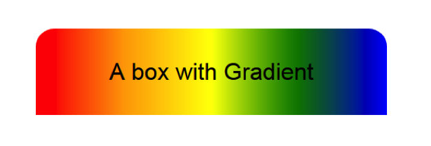
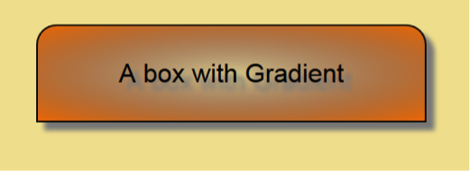

#Challenge: Gradients

**1-**  Create a new HTML page. (transforms.html)  

**2-**  Add  several divs, be sure to give them a width and a height.

**3-**  Try each of the above gradients,include 
a.  Linear,
b.  Transparency, 
c.  multiple stops
d.  Radial,  
  
**4-**  Construct the following divs with Gradients.
 

Radial with transparency and box-shadow.

## Resources

[`box-shadow`](https://developer.mozilla.org/es/docs/Web/CSS/box-shadow) 
- [CSS3 Box Shadow Generator](http://css3gen.com/box-shadow/)