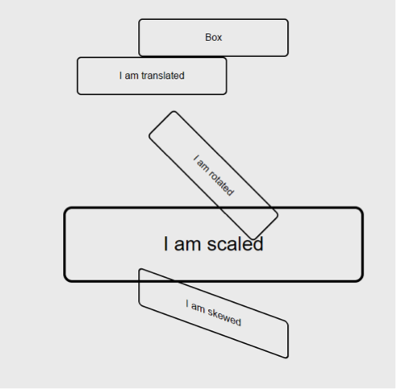

# Challenge: More Transforms

**1-**  Use the hover pseudo-class to create transitions for the following transforms.

**2-**  Also change the color of the gradient from transparent to red when hovered.

**3-**  Experiment with the duration and timing functions. 

## Resources

- [easings](http://easings.net/)
- [Using CSS transitions](https://developer.mozilla.org/en-US/docs/Web/Guide/CSS/Using_CSS_transitions)
